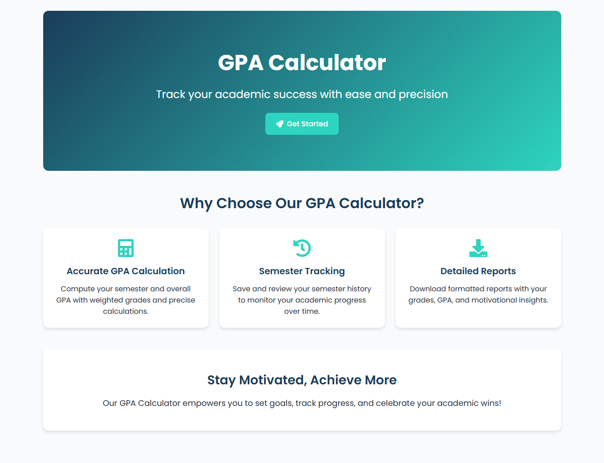
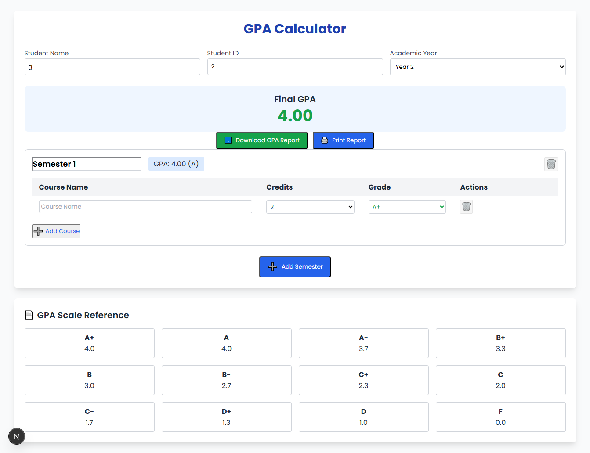

# GPA Calculator Micro SaaS


The **GPA Calculator** is a modern, user-friendly web application designed to help students and academic advisors calculate semester and overall GPA, track academic progress, and manage semester data offline. Built with **Next.js**, **React**, and **LocalStorage**, it features a responsive UI with a navy-teal-orange color palette, Poppins font, and Font Awesome icons. Deployed on **Vercel**, it offers a seamless experience for academic planning.

This project was developed for the **System Administration & Maintenance** course (IT31023, Intake 11 Term 1) to demonstrate advanced DevOps practices, scalable architecture, and user-centric design.

- **Live Demo**: [https://gpa-calculator-rust.vercel.app/](https://gpa-calculator-rust.vercel.app/)
- **GitHub Repository**: [https://github.com/Amaya-Wickramaarachchi/gpa-calculator](https://github.com/Amaya-Wickramaarachchi/gpa-calculator)
- **Wiki**: [https://github.com/Amaya-Wickramaarachchi/gpa-calculator/wiki](https://github.com/Amaya-Wickramaarachchi/gpa-calculator/wiki)

## Features

- **GPA Calculation**: Compute semester GPA and overall Final GPA (FGPA) based on course grades (A+ to F), credits, and weights (Regular: 1x, Weight: 1.1x points).
  - Example: Semester 2 GPA ~3.64 (IT: A+, 3 credits; MATH: A, 3 credits).
- **Semester Tracking**: Save semesters to LocalStorage with labels (e.g., “Fall 2025”), view history, and clear data.
- **Modern UI**: Responsive design with a landing page (hero, feature cards, wave animation) and calculator page (course form, grade table, GPA display).
- **Offline Support**: Store course and semester data in LocalStorage for use without internet.
- **Testing**: Jest unit tests ensure GPA calculation accuracy.
- **Deployment**: Hosted on Vercel with CI/CD for automatic builds.

## Screenshots

### Landing Page

*Hero section with feature cards and “Get Started” button.*

### Calculator Page

*Course form, grade table, and GPA display.*

*Note*: Screenshots should be captured and saved in `docs/images/` before rendering the README.

## Getting Started

### Prerequisites

- **Node.js**: v18 or higher (`node --version`).
- **npm**: v9 or higher (`npm --version`).
- **Git**: For cloning the repository (`git --version`).
- A modern web browser (Chrome, Firefox, Safari).

### Installation

1. **Clone the Repository**:
   ```bash
   git clone https://github.com/Amaya-Wickramaarachchi/gpa-calculator.git
   cd gpa-calculator
   ```
2. **Install Dependencies:**
   ```bash
   npm install
   ```
Installs Next.js, React, and devDependencies like Jest.

3. **Run Locally:**
   ```bash
   npm run dev
   ```
  Starts the development server at http://localhost:3000.
  
4. **Build for Production:**
   ```bash
   npm run build
   npm run start
   ```
  Generates an optimized build and starts the production server.
  
5. **Run Tests:**
   ```bash
   npm run test
   ```
  Executes Jest tests in tests/calculateGpa.test.js.
  


