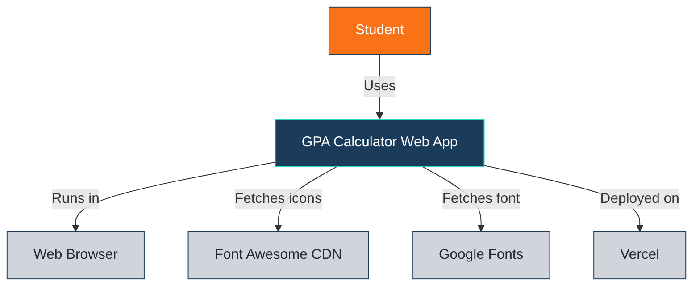
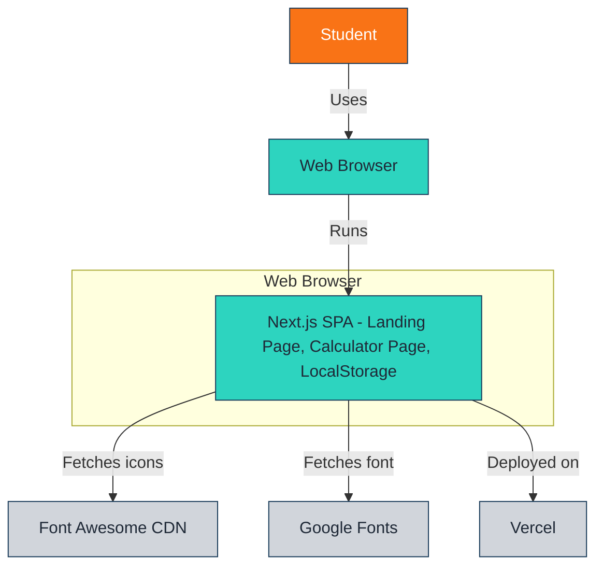

# System Architecture

## GPA Calculator - C4 Context Diagram 

The GPA Calculator is a web application for students to calculate GPA, track semesters, and download reports. It runs in the user’s browser, uses LocalStorage, and is deployed on Vercel. External dependencies include Font Awesome CDN and Google Fonts.

## GPA Calculator - C4 Container Diagram 

The GPA Calculator Web App is a Next.js single-page application (SPA) running in the user’s browser, using LocalStorage for data persistence. It’s deployed on Vercel and relies on Font Awesome CDN and Google Fonts.

## GPA Calculator - C4 Component Diagram (Mermaid)

The GPA Calculator Web App consists of React components (Landing Page, Calculator Page), business logic (GPA calculations, semester management), LocalStorage for data, and global CSS for styling. External dependencies provide icons and fonts.

```mermaid
graph TD
    A[GPA Calculator Web App]

    subgraph UI Components
        B[Landing Page Component - Hero, Features, Motivational]
        C[Calculator Page Component]
        C1[Course Form]
        C2[GPA Calculator]
        C3[Semester History]
        C4[Report Generator]
        C5[Grade Table]
    end

    subgraph Business Logic
        D1[calculateGpa]
        D2[calculateFgpa]
        D3[saveSemester]
        D4[clearSemesterHistory]
        D5[clearCourses]
        D6[downloadReport]
    end

    subgraph Storage
        E[LocalStorage - courses, semesterHistory]
    end

    subgraph Styles
        F[Global CSS - styles.css]
    end

    subgraph External Dependencies
        G[Font Awesome Icons]
        H[Google Fonts - Poppins]
    end

    A --> B
    A --> C
    C --> C1
    C --> C2
    C --> C3
    C --> C4
    C --> C5
    C --> D1
    C --> D2
    C --> D3
    C --> D4
    C --> D5
    C --> D6
    C --> E
    C --> F
    C --> G
    C --> H
    B --> F
    B --> G
    B --> H
    B -->|Navigates to| C

    classDef app fill:#1A3C5A,stroke:#2DD4BF,color:#FFFFFF;
    classDef ui fill:#2DD4BF,stroke:#1A3C5A,color:#1F2937;
    classDef logic fill:#F97316,stroke:#1A3C5A,color:#FFFFFF;
    classDef storage fill:#D1D5DB,stroke:#1A3C5A,color:#1F2937;
    classDef styles fill:#A3E635,stroke:#1A3C5A,color:#1F2937;
    classDef external fill:#D1D5DB,stroke:#1A3C5A,color:#1F2937;

    class A app;
    class B,C,C1,C2,C3,C4,C5 ui;
    class D1,D2,D3,D4,D5,D6 logic;
    class E storage;
    class F styles;
    class G,H external;
```

## GPA Calculator - C4 Code Diagram (Mermaid)

The GPA Calculator Web App is implemented in Next.js with key files: app/page.jsx (landing page), app/calculator/page.jsx (calculator page), app/styles.css (styling), app/layout.jsx (layout), and vercel.json (deployment). Core functions handle GPA calculations, semester management, and UI rendering.

```mermaid
graph TD
    A[GPA Calculator Web App]

    subgraph Pages
        B[app/page.jsx - Home]
        C[app/calculator/page.jsx - Calculator]
    end

    subgraph Calculator Components
        C1[Course Form]
        C2[GPA Calculator]
        C3[Semester History]
        C4[Report Generator]
        C5[Grade Table]
    end

    subgraph Business Logic
        D1[handleAddCourse]
        D2[calculateGpa]
        D3[calculateFgpa]
        D4[saveSemester]
        D5[clearSemesterHistory]
        D6[clearCourses]
        D7[downloadReport]
    end

    subgraph Storage
        E[LocalStorage - courses, semesterHistory]
    end

    subgraph Styles
        F[app/styles.css - hero, button, course-table]
    end

    subgraph Supporting Files
        G[app/layout.jsx - RootLayout]
        H[vercel.json - Routing Config]
    end

    A --> B
    A --> C
    A --> G
    A --> H
    B -->|Navigates to| C
    B --> F
    C --> C1
    C --> C2
    C --> C3
    C --> C4
    C --> C5
    C --> D1
    C --> D2
    C --> D3
    C --> D4
    C --> D5
    C --> D6
    C --> D7
    C --> E
    C --> F

    classDef app fill:#1A3C5A,stroke:#2DD4BF,color:#FFFFFF;
    classDef page fill:#2DD4BF,stroke:#1A3C5A,color:#1F2937;
    classDef component fill:#F97316,stroke:#1A3C5A,color:#FFFFFF;
    classDef logic fill:#F97316,stroke:#1A3C5A,color:#FFFFFF;
    classDef storage fill:#D1D5DB,stroke:#1A3C5A,color:#1F2937;
    classDef styles fill:#A3E635,stroke:#1A3C5A,color:#1F2937;
    classDef support fill:#D1D5DB,stroke:#1A3C5A,color:#1F2937;

    class A app;
    class B,C page;
    class C1,C2,C3,C4,C5 component;
    class D1,D2,D3,D4,D5,D6,D7 logic;
    class E storage;
    class F styles;
    class G,H support;
```

